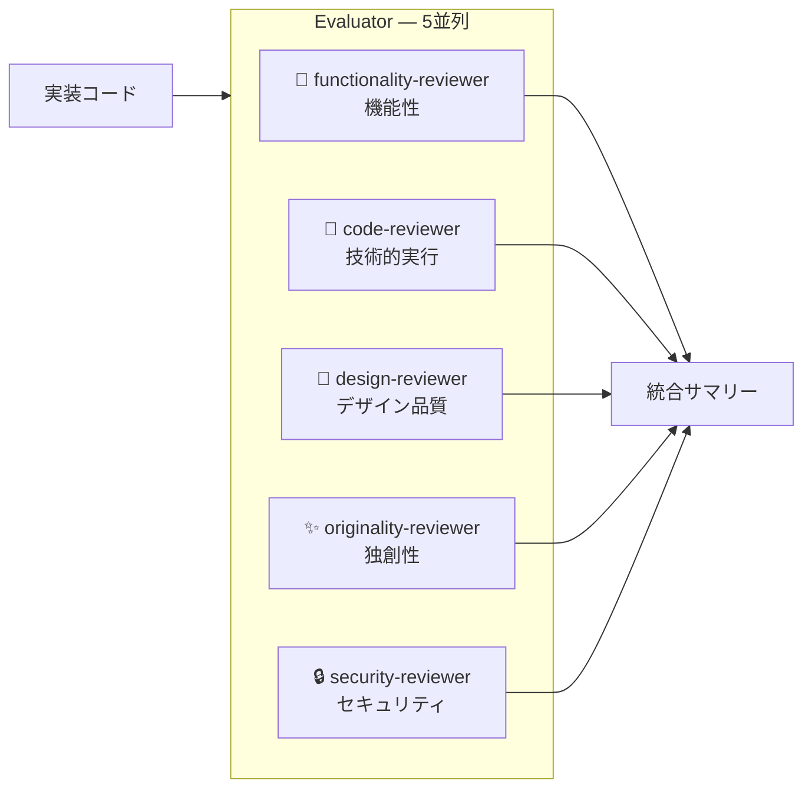

# long-running-harness

Planner → Builder → Evaluator の3エージェントループで複雑なタスクを TDD 実装する Claude Code スキル集。

```
long-running
  └── planner  ──→ issue-plan
  └── builder  ──→ build-cycle ──→ tdd-guide ──→ tdd-cycle
                                                     ├── fix-debt
                                                     ├── flaky-test-detect
                                                     └── coverage-gap
  └── evaluator ──→ evaluate
                      ├── code-reviewer
                      ├── security-reviewer
                      ├── functionality-reviewer
                      ├── design-reviewer
                      └── originality-reviewer
```

## インストール

### Step 1: スキルをインストール（Skills CLI）

```bash
npx skills add ac2393921/long-running-harness -a claude-code
```

以下の8スキルが `~/.claude/skills/` にインストールされます:

| スキル | 役割 |
|---|---|
| `long-running` | メインオーケストレーター |
| `issue-plan` | 計画フェーズ・features.json 生成 |
| `build-cycle` | 実装フェーズ・TDD ループ管理 |
| `tdd-cycle` | RED→GREEN→REFACTOR サイクル |
| `evaluate` | 4軸ルーブリック評価 |
| `fix-debt` | 技術的負債の自動検出・修正 |
| `flaky-test-detect` | フレーキーテスト検出・修正 |
| `coverage-gap` | カバレッジギャップ分析・三角測量 |

### Step 2: エージェントをインストール

```bash
git clone https://github.com/ac2393921/long-running-harness.git
cd long-running-harness
./install-agents.sh
```

以下の9エージェントが `~/.config/agents/agents/` にインストールされます:

`planner`, `builder`, `evaluator`, `tdd-guide`, `code-reviewer`, `security-reviewer`, `functionality-reviewer`, `design-reviewer`, `originality-reviewer`

## 使い方

Claude Code で `/long-running` と入力するだけ。

```
/long-running ユーザー認証機能を実装して
```

### フロー


## 4軸ルーブリック評価

Evaluator フェーズでは **5つの専門エージェントが並列実行**され、実装を多面的に評価します。
実装エージェントのコンテキストを引き継がない新規エージェントとして起動し、自己評価の甘さ（self-leniency）を排除します。

### 評価軸と担当エージェント



| 軸 | 担当エージェント | スコア | 評価内容 |
|---|---|---|---|
| **機能性** | `functionality-reviewer` | 1–5 | DoD チェック・Playwright UI フロー確認 |
| **技術的実行** | `code-reviewer` | 1–5 | テストカバレッジ・SRP/DRY・パフォーマンス |
| **デザイン品質** | `design-reviewer` | 1–5 / N/A | 3ブレークポイントのスクリーンショット・WCAG AA準拠 |
| **独創性** | `originality-reviewer` | 1–5 | 洗練度・工夫・ボイラープレート率 |
| **セキュリティ** | `security-reviewer` | PASS / BLOCKED | OWASP Top 10・インジェクション・シークレット漏洩 |

### 総合スコアと判定

総合スコア = 4軸の算術平均（デザイン品質が N/A の場合は残り3軸で計算）

| 条件 | 判定 | 次のアクション |
|---|---|---|
| security-reviewer で Critical 1件以上 | **BLOCKED** | ユーザーへエスカレーション |
| loop ≥ 3 かつ未解決問題あり | **BLOCKED** | ユーザーへエスカレーション |
| DoD 未達成 1件以上 | **NEEDS REVISION** | Builder へフィードバック、loop + 1 |
| いずれかの軸スコア < 3 | **NEEDS REVISION** | Builder へフィードバック、loop + 1 |
| 総合スコア < 4.0 かつ loop < 3 | **NEEDS REVISION** | Builder へフィードバック、loop + 1 |
| すべての条件をクリア | **PASS** | status: done、次の feature へ |

### 出力サマリー例

```
# Evaluation Summary

**Verdict**: PASS (Loop: 1/3)

| 軸           | エージェント             | スコア | 判定 |
|---|---|---|---|
| 機能性        | functionality-reviewer  | 5/5   | ✓   |
| 技術的実行    | code-reviewer           | 4/5   | ✓   |
| デザイン品質  | design-reviewer         | N/A   | -   |
| 独創性        | originality-reviewer    | 4/5   | ✓   |
| セキュリティ  | security-reviewer       | PASS  | ✓   |

総合スコア（N/A 除く）: 4.3/5
```

## skill-usage.json

各 `tdd-cycle` フェーズの実行ログが `.claude/orchestrate/{session}/skill-usage.json` に記録されます。
TDD が実際に実行されたか監査できます。

```json
{
  "version": "1.0",
  "invocations": [
    { "skill": "tdd-cycle", "phase": "RED",      "result": "FAIL" },
    { "skill": "tdd-cycle", "phase": "GREEN",    "result": "PASS" },
    { "skill": "tdd-cycle", "phase": "REFACTOR", "result": "PASS" }
  ]
}
```
