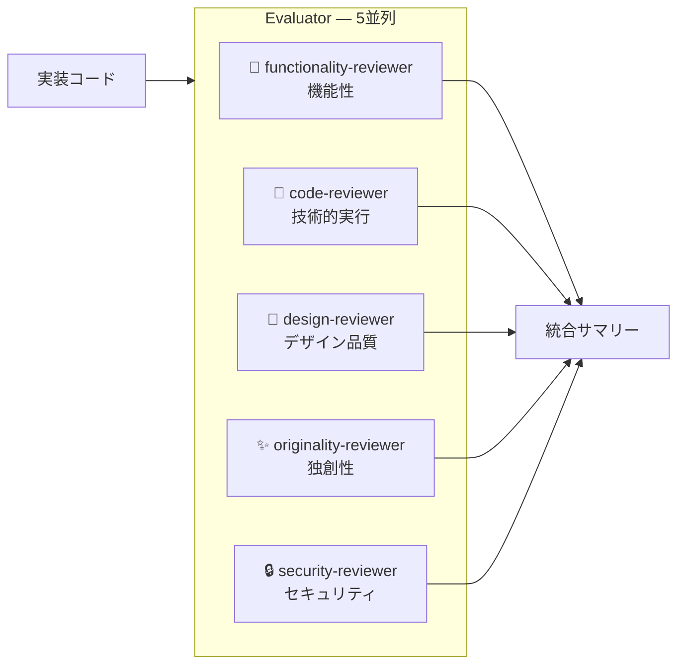
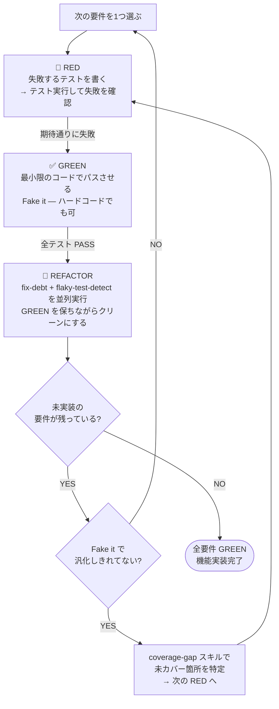

# long-running-harness

Planner → Builder → Evaluator の3エージェントループで複雑なタスクを TDD 実装する Claude Code スキル集。

```
long-running
  └── planner  ──→ issue-plan
  └── builder  ──→ build-cycle ──→ tdd-guide ──→ tdd-cycle
                                                     ├── fix-debt
                                                     ├── flaky-test-detect
                                                     └── coverage-gap
  └── evaluator ──→ evaluate
                      ├── code-reviewer
                      ├── security-reviewer
                      ├── functionality-reviewer
                      ├── design-reviewer
                      └── originality-reviewer
```

## インストール

### Step 1: スキルをインストール（Skills CLI）

```bash
npx skills add ac2393921/long-running-harness -a claude-code
```

以下の8スキルが `~/.claude/skills/` にインストールされます:

| スキル | 役割 |
|---|---|
| `long-running` | メインオーケストレーター |
| `issue-plan` | 計画フェーズ・features.json 生成 |
| `build-cycle` | 実装フェーズ・TDD ループ管理 |
| `tdd-cycle` | RED→GREEN→REFACTOR サイクル |
| `evaluate` | 4軸ルーブリック評価 |
| `fix-debt` | 技術的負債の自動検出・修正 |
| `flaky-test-detect` | フレーキーテスト検出・修正 |
| `coverage-gap` | カバレッジギャップ分析・三角測量 |

### Step 2: エージェントをインストール

```bash
git clone https://github.com/ac2393921/long-running-harness.git
cd long-running-harness
./install-agents.sh
```

以下の9エージェントが `~/.config/agents/agents/` にインストールされます:

`planner`, `builder`, `evaluator`, `tdd-guide`, `code-reviewer`, `security-reviewer`, `functionality-reviewer`, `design-reviewer`, `originality-reviewer`

## 使い方

Claude Code で `/long-running` と入力するだけ。

```
/long-running ユーザー認証機能を実装して
```

### フロー


## 4軸ルーブリック評価

Evaluator フェーズでは **5つの専門エージェントが並列実行**され、実装を多面的に評価します。
実装エージェントのコンテキストを引き継がない新規エージェントとして起動し、自己評価の甘さ（self-leniency）を排除します。

### 評価軸と担当エージェント



| 軸 | 担当エージェント | スコア | 評価内容 |
|---|---|---|---|
| **機能性** | `functionality-reviewer` | 1–5 | DoD チェック・Playwright UI フロー確認 |
| **技術的実行** | `code-reviewer` | 1–5 | テストカバレッジ・SRP/DRY・パフォーマンス |
| **デザイン品質** | `design-reviewer` | 1–5 / N/A | 3ブレークポイントのスクリーンショット・WCAG AA準拠 |
| **独創性** | `originality-reviewer` | 1–5 | 洗練度・工夫・ボイラープレート率 |
| **セキュリティ** | `security-reviewer` | PASS / BLOCKED | OWASP Top 10・インジェクション・シークレット漏洩 |

### 総合スコアと判定

総合スコア = 4軸の算術平均（デザイン品質が N/A の場合は残り3軸で計算）

| 条件 | 判定 | 次のアクション |
|---|---|---|
| security-reviewer で Critical 1件以上 | **BLOCKED** | ユーザーへエスカレーション |
| loop ≥ 3 かつ未解決問題あり | **BLOCKED** | ユーザーへエスカレーション |
| DoD 未達成 1件以上 | **NEEDS REVISION** | Builder へフィードバック、loop + 1 |
| いずれかの軸スコア < 3 | **NEEDS REVISION** | Builder へフィードバック、loop + 1 |
| 総合スコア < 4.0 かつ loop < 3 | **NEEDS REVISION** | Builder へフィードバック、loop + 1 |
| すべての条件をクリア | **PASS** | status: done、次の feature へ |

### 出力サマリー例

```
# Evaluation Summary

**Verdict**: PASS (Loop: 1/3)

| 軸           | エージェント             | スコア | 判定 |
|---|---|---|---|
| 機能性        | functionality-reviewer  | 5/5   | ✓   |
| 技術的実行    | code-reviewer           | 4/5   | ✓   |
| デザイン品質  | design-reviewer         | N/A   | -   |
| 独創性        | originality-reviewer    | 4/5   | ✓   |
| セキュリティ  | security-reviewer       | PASS  | ✓   |

総合スコア（N/A 除く）: 4.3/5
```

## TDD サイクル（tdd-cycle）

Builder フェーズの中核。t-wada式TDD の **RED → GREEN → REFACTOR** サイクルで1要件ずつ実装します。
「テストが仕様書」という思想に基づき、コードを書く前に必ず失敗するテストを書きます。

### サイクル全体図



### 🔴 RED フェーズ — 失敗するテストを書く

- **1要件 = 1テスト**。複数の振る舞いを一度にテストしない
- テスト名は「〜のとき〜になる」という仕様の文章で書く
- AAA パターン（Arrange / Act / Assert）を意識する
- テストを実行して**期待通りに失敗**することを必ず確認する
  - `ImportError` や `NameError` で落ちるのは正常（実装がまだないため）
  - 「偶然 PASS」したらテストが間違っている

### ✅ GREEN フェーズ — 最小限のコードでパスさせる

> **テストをパスさせるための最小限のコードだけを書く。それ以上書かない。**

**Fake it till you make it** — 最初はハードコードした定数を返すだけでよい。

| 状況 | ❌ NG（完成形を先に書く） | ✅ OK（Fake it） |
|---|---|---|
| 数値を返す | `if n%15==0: return "FizzBuzz" ...` | `return "1"` |
| bool を返す | `return len(self._items)==0` | `return True` |
| 計算する | `self._items.append(item); return sum(...)` | `return 0` |

完成形を先に書くと三角測量が機能しない。「恥ずかしいコード」が次のテストを追加する動機を生み、自然に汎化される。

### 🔵 REFACTOR フェーズ — 2スキルを並列実行してクリーンにする

GREEN になったら `fix-debt` と `flaky-test-detect` を**並列実行**する。

| スキル | 対象 | 検出・修正内容 |
|---|---|---|
| `fix-debt` | プロダクションコード | 条件分岐・カプセル化・関心の分離の3基準で負債を検出・自動修正。リグレッションが出た修正は自動リバート |
| `flaky-test-detect` | テストコード | TIMING / GLOBAL_STATE 等のパターンでフレーキーテストを検出・修正し、安定を確認 |

両スキルの修正は独立しているため並列実行が安全。その後、命名・マジックナンバーなど軽微な問題を手動修正し、1変更ごとにテストを実行して GREEN を維持する。

### 三角測量（Triangulation）

Fake it で汎化しきれていない場合、`coverage-gap` スキルで未カバー箇所を特定し、次の RED を追加する。

```python
# テスト1: add(1, 1) == 2  → return 2 で Fake できてしまう
# ↓ coverage-gap 実行 → "a≠b のケースが未カバー" と報告
# テスト2: add(2, 3) == 5  → これで return a + b を強制される
```

### アンチパターン

| アンチパターン | 問題 |
|---|---|
| テストより先に実装を書く | TDD ではない |
| 複数の要件を一度にテストする | 1テスト1振る舞いの原則違反 |
| RED を確認せずに GREEN へ進む | 「偶然 PASS」に気づけない |
| 過剰実装（YAGNI 違反） | 今必要なものだけ実装する |
| REFACTOR 中にテストを壊す | GREEN を保ちながら変更する |

### 対応言語

| 言語 | フレームワーク | コマンド |
|---|---|---|
| Python | pytest | `pytest -v [test_file]` |
| TypeScript / JS | vitest | `npx vitest run [test_file]` |
| TypeScript / JS | jest | `npx jest [test_file]` |
| Go | testing | `go test ./...` |
| Rust | cargo test | `cargo test` |

## skill-usage.json

各 `tdd-cycle` フェーズの実行ログが `.claude/orchestrate/{session}/skill-usage.json` に記録されます。
TDD が実際に実行されたか監査できます。

```json
{
  "version": "1.0",
  "invocations": [
    { "skill": "tdd-cycle", "phase": "RED",      "result": "FAIL" },
    { "skill": "tdd-cycle", "phase": "GREEN",    "result": "PASS" },
    { "skill": "tdd-cycle", "phase": "REFACTOR", "result": "PASS" }
  ]
}
```
