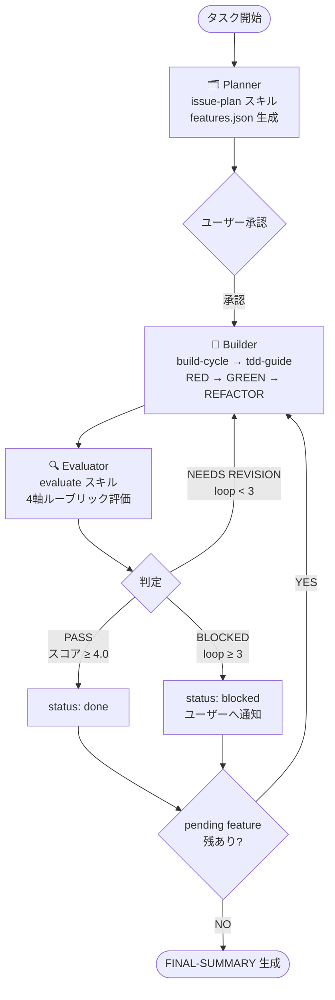
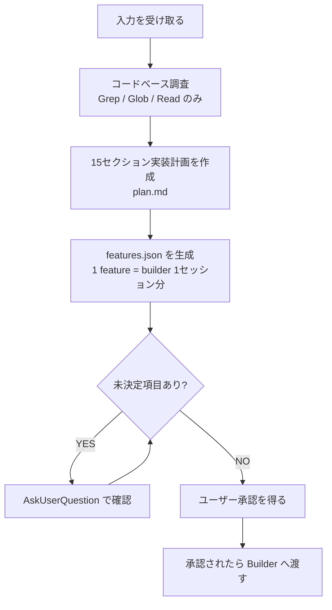
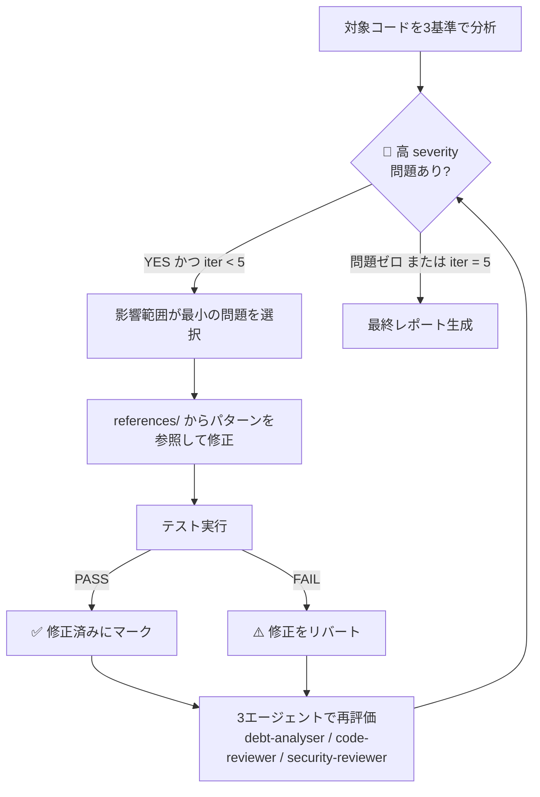
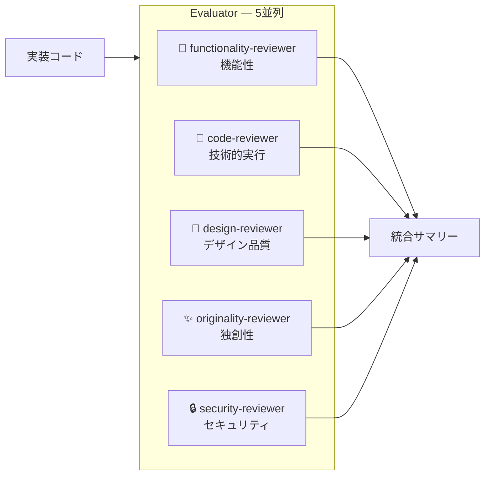

# long-running-harness

Planner → Builder → Evaluator の3エージェントループで複雑なタスクを TDD 実装する Claude Code スキル集。

```
long-running
  └── planner  ──→ issue-plan
  └── builder  ──→ build-cycle ──→ tdd-guide ──→ tdd-cycle
                                                     ├── fix-debt
                                                     ├── flaky-test-detect
                                                     └── coverage-gap
  └── evaluator ──→ evaluate
                      ├── code-reviewer
                      ├── security-reviewer
                      ├── functionality-reviewer
                      ├── design-reviewer
                      └── originality-reviewer
```

## インストール

### Step 1: スキルをインストール（Skills CLI）

```bash
npx skills add ac2393921/long-running-harness -a claude-code
```

以下の8スキルが `~/.claude/skills/` にインストールされます:

| スキル | 役割 |
|---|---|
| `long-running` | メインオーケストレーター |
| `issue-plan` | 計画フェーズ・features.json 生成 |
| `build-cycle` | 実装フェーズ・TDD ループ管理 |
| `tdd-cycle` | RED→GREEN→REFACTOR サイクル |
| `evaluate` | 4軸ルーブリック評価 |
| `fix-debt` | 技術的負債の自動検出・修正 |
| `flaky-test-detect` | フレーキーテスト検出・修正 |
| `coverage-gap` | カバレッジギャップ分析・三角測量 |

### Step 2: エージェントをインストール

```bash
git clone https://github.com/ac2393921/long-running-harness.git
cd long-running-harness
./install-agents.sh
```

以下の9エージェントが `~/.config/agents/agents/` にインストールされます:

`planner`, `builder`, `evaluator`, `tdd-guide`, `code-reviewer`, `security-reviewer`, `functionality-reviewer`, `design-reviewer`, `originality-reviewer`

## 使い方

Claude Code で `/long-running` と入力するだけ。

```
/long-running ユーザー認証機能を実装して
```

### 全体フロー



---

## Planner（計画フェーズ）

Planner は `issue-plan` スキルを使い、タスクを **実装可能な最小機能単位（feature）** に分解します。
Builder が「何を・どの順に・どのテストで」実装すべきかを定義するのが唯一の責務です。

### 入力

| 入力形式 | 例 |
|---|---|
| GitHub Issue URL / 番号 | `#123`, `https://github.com/org/repo/issues/123` |
| 自由記述 | 「Claude.ai のクローンを作って」 |
| 引数なし | AskUserQuestion でタスクを確認する |

### 6ステップのワークフロー



> **制約**: Planner は Read / Grep / Glob のみ使用します。コードの変更は一切行いません。

### 15セクション実装計画（plan.md）

Planner が生成する `plan.md` は以下の15セクションで構成されます。

| # | セクション | 内容 |
|---|---|---|
| 1 | Acceptance Criteria 確認 | 明記された条件・曖昧点の質問リスト |
| 2 | スコープ定義 | In Scope / Out of Scope |
| 3 | 調査結果 | 関連ファイル・既存パターン・影響範囲 |
| 4 | 実装方針 | フェーズ別ステップ・影響ファイル一覧 |
| 5 | DB スキーマ変更 | Migration SQL・ロールバック計画 |
| 6 | API 契約・後方互換性 | 新規/変更 API・移行戦略 |
| 7 | セキュリティ・パフォーマンス | インジェクション対策・N+1 評価 |
| 8 | テスト戦略（t-wada式 TDD 3層） | Unit / Integration / E2E テストケース列挙 |
| 9 | ドキュメント更新の必要性 | 更新対象ファイル・ADR |
| 10 | デプロイ考慮事項 | ロールアウト方式・ロールバック計画 |
| 11 | Definition of Done | 完了の定義チェックリスト |
| 12 | リスク・注意点 | 影響度・対策 |
| 13 | 確認事項・未決定項目 | ユーザーへの質問リスト |
| 14 | タイムライン推定 | フェーズ別工数見積もり |
| 15 | features.json | Builder への入力アーティファクト |

### features.json — Builder への唯一の入力

Planner の最終成果物。Builder は `status: "pending"` の feature を `sequence` 順に1件ずつ実装します。

```json
{
  "features": [
    {
      "id": "feat-001",
      "title": "ユーザー登録API",
      "description": "POST /api/users を実装し、バリデーション・DB保存・レスポンスを返す",
      "phase": 1,
      "acceptance_criteria": ["メールアドレスの重複を弾く", "201 Created を返す"],
      "files": {
        "create": ["src/api/users.py", "tests/test_users.py"],
        "modify": ["src/db/schema.sql"]
      },
      "tests": {
        "unit": [
          { "name": "test_validate_email_rejects_duplicate", "file": "tests/test_users.py" }
        ],
        "integration": [
          { "name": "test_POST_users_returns_201", "file": "tests/test_users.py" }
        ]
      },
      "dependencies": [],
      "status": "pending"
    }
  ]
}
```

**feature 設計のルール**:

| ルール | 理由 |
|---|---|
| 1 feature = builder が1セッションで実装できる量 | Context Rot（コンテキスト汚染）を防ぐ |
| `tests` には「最初は失敗するテスト」を列挙 | TDD の RED フェーズの仕様書になる |
| `dependencies` に先行 feature の id を記載 | Builder が正しい順序で実装できる |
| `status` は常に `"pending"` で初期化 | Harness がランタイム状態を管理する |

### ユーザー承認が必須

Planner は `features.json` をチャット内にインライン表示し、ユーザーの承認を待ちます。
**承認なしに Builder を起動しません**。未決定項目がある場合は `AskUserQuestion` で確認してから進みます。

---

## Builder（実装フェーズ）

Builder は `build-cycle` スキル経由で `tdd-guide` エージェントを起動し、
`features.json` の `status: "pending"` な feature を **1件ずつ TDD で実装**します。

実装完了後は `builder-notes-{FEATURE-ID}.md` を出力し、Evaluator へ渡します。
Evaluator から NEEDS REVISION が返ってきた場合は `evaluator_feedback` を読み込んで再実装します（最大3回）。

### build-cycle の呼び出し連鎖

```
Builder エージェント
  └── build-cycle スキル（LOAD → IMPLEMENT → VERIFY）
        └── tdd-guide エージェント
              └── tdd-cycle スキル（RED → GREEN → REFACTOR）
                    ├── fix-debt スキル（REFACTOR フェーズ）
                    ├── flaky-test-detect スキル（REFACTOR フェーズ）
                    └── coverage-gap スキル（三角測量）
```

`build-cycle` は最初に `skill-usage.json` を初期化し、`tdd-cycle` の各フェーズ実行ログをそこに追記します。

### TDD サイクル（tdd-cycle）

Builder フェーズの中核。t-wada式TDD の **RED → GREEN → REFACTOR** サイクルで1要件ずつ実装します。
「テストが仕様書」という思想に基づき、コードを書く前に必ず失敗するテストを書きます。

#### サイクル全体図


#### 🔴 RED フェーズ — 失敗するテストを書く

- **1要件 = 1テスト**。複数の振る舞いを一度にテストしない
- テスト名は「〜のとき〜になる」という仕様の文章で書く
- AAA パターン（Arrange / Act / Assert）を意識する
- テストを実行して**期待通りに失敗**することを必ず確認する
  - `ImportError` や `NameError` で落ちるのは正常（実装がまだないため）
  - 「偶然 PASS」したらテストが間違っている

#### ✅ GREEN フェーズ — 最小限のコードでパスさせる

> **テストをパスさせるための最小限のコードだけを書く。それ以上書かない。**

**Fake it till you make it** — 最初はハードコードした定数を返すだけでよい。

| 状況 | ❌ NG（完成形を先に書く） | ✅ OK（Fake it） |
|---|---|---|
| 数値を返す | `if n%15==0: return "FizzBuzz" ...` | `return "1"` |
| bool を返す | `return len(self._items)==0` | `return True` |
| 計算する | `self._items.append(item); return sum(...)` | `return 0` |

完成形を先に書くと三角測量が機能しない。「恥ずかしいコード」が次のテストを追加する動機を生み、自然に汎化される。

#### 🔵 REFACTOR フェーズ — 2スキルを並列実行してクリーンにする

GREEN になったら `fix-debt` と `flaky-test-detect` を**並列実行**する。

| スキル | 対象 | 検出・修正内容 |
|---|---|---|
| `fix-debt` | プロダクションコード | 条件分岐・カプセル化・関心の分離の3基準で負債を検出・自動修正。リグレッションが出た修正は自動リバート |
| `flaky-test-detect` | テストコード | TIMING / GLOBAL_STATE 等のパターンでフレーキーテストを検出・修正し、安定を確認 |

両スキルの修正は独立しているため並列実行が安全。その後、命名・マジックナンバーなど軽微な問題を手動修正し、1変更ごとにテストを実行して GREEN を維持する。

#### fix-debt — 技術的負債の自動修正

REFACTOR フェーズで `flaky-test-detect` と並列実行される。プロダクションコードを**3つの品質基準**で分析し、高 severity 問題をゼロにするまで自動修正ループを回す。

##### 3つの品質基準

| 基準 | 対象 | 主な問題パターン |
|---|---|---|
| **条件分岐** | if/else のネスト | 4段以上のネスト・else の連鎖 → 早期 return・ガード節に変換 |
| **カプセル化** | クラス設計 | public フィールド・貧血モデル・Primitive Obsession → Value Object・完全コンストラクタ等 |
| **関心の分離（SoC）** | モジュール責務 | God Object・複数責務の混在 → 責務ごとに分割 |

##### 自動修正ループ（最大 5 イテレーション）



##### 深刻度の判定基準

| 深刻度 | 条件 |
|---|---|
| 🔴 高 | 5つ以上の関心事 / God Object / 重大なカプセル化違反 / 4段以上のネスト |
| 🟡 中 | 3–4の関心事 / 中程度のネスト / 貧血モデル / Primitive Obsession |
| 🟢 低 | 軽微なネスト / 命名問題 / Demeter 法則の軽微な違反 |

修正ループが回るのは 🔴 高 のみ。🟡 中・🟢 低 は最終レポートに残存問題として記録される。

##### テスト失敗時は自動リバート

修正後のテストが失敗した場合、その変更を即座にリバートして「修正不可」フラグを立て、次の問題に移る。リグレッションを絶対に持ち込まない設計になっている。

##### 再評価は3エージェント並列

各イテレーション末に **debt-analyser・code-reviewer・security-reviewer** を並列起動して再評価する。修正した本人が評価すると自己評価の甘さ（self-leniency）が生じるため、独立したエージェントに委任する。

#### 三角測量（Triangulation）

Fake it で汎化しきれていない場合、`coverage-gap` スキルで未カバー箇所を特定し、次の RED を追加する。

```python
# テスト1: add(1, 1) == 2  → return 2 で Fake できてしまう
# ↓ coverage-gap 実行 → "a≠b のケースが未カバー" と報告
# テスト2: add(2, 3) == 5  → これで return a + b を強制される
```

### アンチパターン

| アンチパターン | 問題 |
|---|---|
| テストより先に実装を書く | TDD ではない |
| 複数の要件を一度にテストする | 1テスト1振る舞いの原則違反 |
| RED を確認せずに GREEN へ進む | 「偶然 PASS」に気づけない |
| 過剰実装（YAGNI 違反） | 今必要なものだけ実装する |
| REFACTOR 中にテストを壊す | GREEN を保ちながら変更する |

### 対応言語

| 言語 | フレームワーク | コマンド |
|---|---|---|
| Python | pytest | `pytest -v [test_file]` |
| TypeScript / JS | vitest | `npx vitest run [test_file]` |
| TypeScript / JS | jest | `npx jest [test_file]` |
| Go | testing | `go test ./...` |
| Rust | cargo test | `cargo test` |

---

## Evaluator（評価フェーズ）

Builder が実装を終えたら、Evaluator が**独立した新規コンテキスト**で品質を評価します。
Builder のコンテキストを一切引き継がないことが重要です。これにより実装者による自己評価の甘さ（self-leniency）を排除します。

評価結果に応じて Harness がループを制御します。

| 判定 | 条件 | 次のアクション |
|---|---|---|
| **PASS** | 総合スコア ≥ 4.0 かつ即 BLOCKED 条件なし | `status: done`、次の feature へ |
| **NEEDS REVISION** | 総合スコア < 4.0 かつ loop < 3 | `evaluator_feedback` を記録して Builder へ差し戻し |
| **BLOCKED** | Critical セキュリティ問題 または loop ≥ 3 | `status: blocked`、ユーザーへエスカレーション |

### Uncorrelated Evaluator — Self-leniency 防止

```
Builder エージェント（コンテキスト A）
  → 実装完了 → コンテキスト破棄

Evaluator エージェント（コンテキスト B ← 新規）
  → features.json + builder-notes + 変更コードのみを読み込んで評価
  → Builder の思考・判断・言い訳を一切知らない状態で採点
```

Evaluator は「なぜそう実装したか」を知らないまま採点するため、結果が厳格になります。
NEEDS REVISION 時の `evaluator_feedback` は次の Builder セッションへの唯一の橋渡しです。

### 4軸ルーブリック評価

5つの専門エージェントが**並列実行**され、実装を多面的に評価します。



| 軸 | 担当エージェント | スコア | 評価内容 |
|---|---|---|---|
| **機能性** | `functionality-reviewer` | 1–5 | DoD チェック・Playwright UI フロー確認 |
| **技術的実行** | `code-reviewer` | 1–5 | テストカバレッジ・SRP/DRY・パフォーマンス |
| **デザイン品質** | `design-reviewer` | 1–5 / N/A | 3ブレークポイントのスクリーンショット・WCAG AA準拠 |
| **独創性** | `originality-reviewer` | 1–5 | 洗練度・工夫・ボイラープレート率 |
| **セキュリティ** | `security-reviewer` | PASS / BLOCKED | OWASP Top 10・インジェクション・シークレット漏洩 |

### 総合スコアと判定

総合スコア = 4軸の算術平均（デザイン品質が N/A の場合は残り3軸で計算）

| 条件 | 判定 | 次のアクション |
|---|---|---|
| security-reviewer で Critical 1件以上 | **BLOCKED** | ユーザーへエスカレーション |
| loop ≥ 3 かつ未解決問題あり | **BLOCKED** | ユーザーへエスカレーション |
| DoD 未達成 1件以上 | **NEEDS REVISION** | Builder へフィードバック、loop + 1 |
| いずれかの軸スコア < 3 | **NEEDS REVISION** | Builder へフィードバック、loop + 1 |
| 総合スコア < 4.0 かつ loop < 3 | **NEEDS REVISION** | Builder へフィードバック、loop + 1 |
| すべての条件をクリア | **PASS** | status: done、次の feature へ |

### 出力サマリー例

```
# Evaluation Summary

**Verdict**: PASS (Loop: 1/3)

| 軸           | エージェント             | スコア | 判定 |
|---|---|---|---|
| 機能性        | functionality-reviewer  | 5/5   | ✓   |
| 技術的実行    | code-reviewer           | 4/5   | ✓   |
| デザイン品質  | design-reviewer         | N/A   | -   |
| 独創性        | originality-reviewer    | 4/5   | ✓   |
| セキュリティ  | security-reviewer       | PASS  | ✓   |

総合スコア（N/A 除く）: 4.3/5
```

---

## skill-usage.json

各 `tdd-cycle` フェーズの実行ログが `.claude/orchestrate/{session}/skill-usage.json` に記録されます。
TDD が実際に実行されたか監査できます。

```json
{
  "version": "1.0",
  "invocations": [
    { "skill": "tdd-cycle", "phase": "RED",      "result": "FAIL" },
    { "skill": "tdd-cycle", "phase": "GREEN",    "result": "PASS" },
    { "skill": "tdd-cycle", "phase": "REFACTOR", "result": "PASS" }
  ]
}
```
